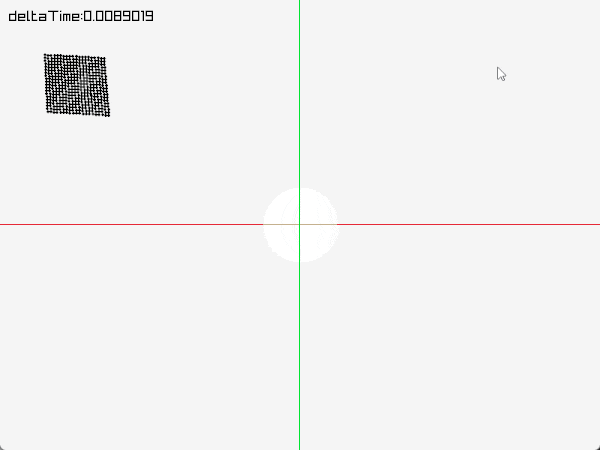
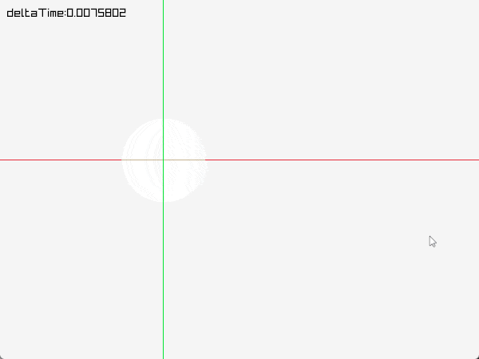
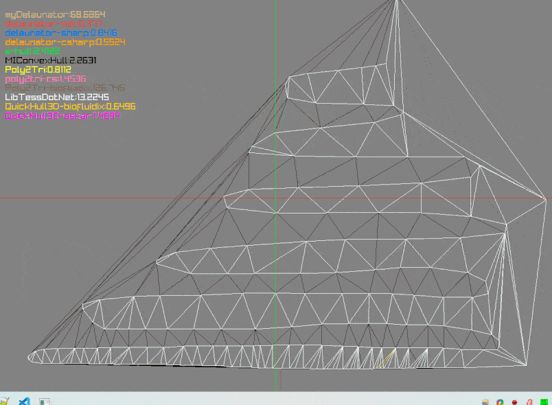

## Implemented
- Verlet
    - substepping
    - edges/links/constraints
    - collisions
    - quadTree optimized
- Triangulation

## TODO
  - Verlet collision 'shapes' ?
    - Circle
    - Edge
    - Triangle
  - Convert some stuff to 3D

## Showcase

## Libraries
- [rayLib](https://www.raylib.com/) for rendering
- [delaunator-net](https://github.com/modios/delaunator-net) fast as hell
- [delaunator-sharp](https://github.com/nol1fe/delaunator-sharp) same
- [delaunator-csharp](https://github.com/wolktocs/delaunator-csharp) slightly slower (still hella fast)
- [s-hull](http://www.s-hull.org/) cs port of s-hull - it is slower than above
- [MIConvexHull](https://designengrlab.github.io/MIConvexHull/) not fast - however it is an n-dimensional solution?
- [Poly2Tri](https://github.com/Syncaidius/Poly2Tri) faster than original poly2tri-cs version - probably because it was ported from Java?
- [poly2tri-cs](https://github.com/Unity-Technologies/poly2tri-cs) not slow, not fast, no complains you know
- [Poly2Tri(biofluidix)](https://github.com/BioFluidix/Poly2Tri) pretty fucking slow - probably an early fork of the Java port?
- [LibTessDotNet](https://github.com/speps/LibTessDotNet) not fast, several times slower than modern Poly2Tri

Obviously comparing some of the constrained delaunay vs non-constrained delaunay, or even 2D vs 3D vs nD isn't fair - so weight your judgement properly.

## License
MANY EXTERNAL LIBRARIES IN USE (DIFFERING LICENSES) - CHECK THEIR SPECIFIC LICENSES